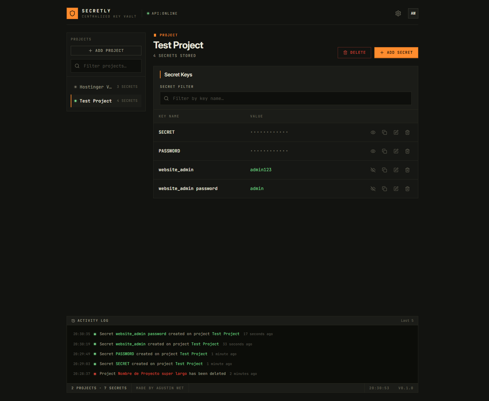

# Secretly

Un gestor de secretos local para guardar API keys, tokens y variables de entorno de forma organizada y cifrada. Pensado para quien trabaja con varios proyectos y necesita un lugar central donde consultar, copiar y actualizar credenciales sin perder el rastro de los cambios.

---

## Qué hace

Secretly organiza tus secretos por **proyectos**. Cada proyecto funciona como una bóveda independiente: ahí guardás pares clave-valor (por ejemplo `STRIPE_API_KEY` o `DATABASE_URL`) y los consultás cuando los necesitás.

La interfaz está pensada para el uso diario:

- **Barra lateral** con todos tus proyectos, búsqueda rápida y acceso directo para crear uno nuevo.
- **Panel principal** que muestra el proyecto activo, cuántos secretos tiene y una tabla con todas las claves.
- **Valores enmascarados** por defecto. Podés revelarlos, copiarlos al portapapeles, editarlos en línea o eliminarlos con confirmación.
- **Indicador de estado** en el encabezado que muestra si la API está online u offline.
- **Registro de actividad** en el pie de página con las últimas acciones realizadas en la bóveda.
- **Ajustes** para exportar un backup en JSON de todos tus proyectos y secretos.

Todo se almacena cifrado en una base de datos PostgreSQL. La API está protegida con autenticación HTTP Basic.

---

## Captura



---

## Cómo usarlo

### 1. Crear un proyecto

En la barra lateral, hacé clic en **Add Project**. Elegí un nombre y confirmá. El proyecto aparece en la lista y queda seleccionado automáticamente.

### 2. Agregar secretos

Con un proyecto activo, usá **Add Secret** en el banner superior. Ingresá el nombre de la clave y su valor, luego guardá. El secreto aparece en la tabla del panel principal.

### 3. Gestionar secretos

Cada fila de la tabla tiene acciones rápidas:

| Acción   | Qué hace                             |
| -------- | ------------------------------------ |
| Ojo      | Muestra u oculta el valor            |
| Copiar   | Copia el valor al portapapeles       |
| Editar   | Habilita edición en línea del valor  |
| Eliminar | Borra el secreto (pide confirmación) |

También podés filtrar secretos por nombre de clave usando el campo de búsqueda del panel.

### 4. Cambiar de proyecto

Hacé clic en cualquier proyecto de la barra lateral. El panel principal se actualiza con sus secretos y el contador correspondiente.

### 5. Revisar actividad

El registro en el pie de página muestra las últimas acciones: creaciones, ediciones y eliminaciones. Sirve para saber qué cambió y cuándo.

### 6. Exportar un backup

Abrí **Settings** (ícono de engranaje en el encabezado) y usá **Export Secrets** para descargar un JSON con todos tus proyectos. Guardalo en un lugar seguro.

---

## Stack

| Capa          | Tecnología                                 |
| ------------- | ------------------------------------------ |
| Frontend      | React 19, TypeScript, Vite, Tailwind CSS 4 |
| Backend       | Spring Boot 3.4, Java 17                   |
| Base de datos | PostgreSQL 16                              |
| Contenedores  | Docker / Docker Compose                    |

---

## Para desarrolladores

> Documentación devops completa (en inglés): [Arquitectura](devops/docs/architecture.md) · [Desarrollo](devops/docs/development.md) · [Deployment](devops/docs/deployment.md)

### Requisitos

- **Docker** y **Docker Compose** (para la base de datos en desarrollo)
- **Java 17** (la API corre local con hot reload; Maven viene incluido vía `mvnw`)
- **Node.js** 18+ y **npm** (para el frontend en modo desarrollo)

### Variables de entorno

Creá un archivo `.env` en la raíz del proyecto. Podés partir de `devops/example.env`:

```bash
cp devops/example.env .env
```

| Variable              | Descripción                                                                                                            |
| --------------------- | ---------------------------------------------------------------------------------------------------------------------- |
| `API_SECRET`          | Clave privada para cifrar y descifrar secretos. **Cambiala en producción.**                                            |
| `DB_HOST`             | Host de PostgreSQL. Usá `db` con Docker Compose; en desarrollo `dev.sh` lo sobreescribe a `localhost` automáticamente. |
| `DB_PORT`             | Puerto de PostgreSQL (por defecto `5432`).                                                                             |
| `DB_NAME`             | Nombre de la base de datos.                                                                                            |
| `DB_USER` / `DB_PASS` | Credenciales de PostgreSQL.                                                                                            |
| `DB_DLL_MODE`         | Modo de esquema Hibernate. Usá `update` en desarrollo; `create-drop` solo si querés recrear la DB desde cero.          |
| `LOGGING_LEVEL`       | Nivel de logs de Spring Security (`DEBUG`, `INFO`, `TRACE`, etc.).                                                     |
| `CORS_HOST`           | Host del frontend permitido por CORS. En desarrollo local, `localhost`.                                                |

### Arrancar el entorno de desarrollo

Tanto la API como el frontend tienen hot reload. Solo la base de datos corre en Docker.

**Terminal 1 — Base de datos + API:**

```bash
./devops/scripts/dev.sh
```

El script levanta PostgreSQL en Docker, espera a que esté healthy y arranca la API con `./mvnw spring-boot:run`. Gracias a `spring-boot-devtools`, la API se reinicia sola (~1-2s) cada vez que el IDE recompila al guardar. Más detalles en [development.md](devops/docs/development.md).

**Terminal 2 — Frontend:**

```bash
cd frontend
npm install
npm run dev
```

### URLs y credenciales por defecto

| Servicio        | URL                                                      |
| --------------- | -------------------------------------------------------- |
| Frontend (Vite) | [http://localhost:5173](http://localhost:5173)           |
| API             | [http://localhost:8080/api/](http://localhost:8080/api/) |
| PostgreSQL      | localhost:5432                                           |

Credenciales de la API (desarrollo):

- Usuario: `admin`
- Contraseña: `adminpass`

El frontend las envía automáticamente en cada request. Si cambiás las credenciales en el backend, actualizá también `frontend/src/lib/constants.ts`.

### Comandos útiles

```bash
# Frontend
cd frontend
npm run dev          # Servidor de desarrollo con hot-reload
npm run build        # Build de producción
npm run lint         # ESLint
npm run format       # Prettier (formatea todo el repo)

# Entorno de desarrollo
./devops/scripts/dev.sh                # Levantar DB + API con hot reload
./devops/scripts/dev-down.sh           # Detener la DB de desarrollo
./devops/scripts/dev-down.sh --volumes # Detener la DB y borrar los datos

# Stack de producción local (frontend + API + DB en Docker, build desde source)
./devops/scripts/prod-local.sh         # Levantar — http://localhost:3000
./devops/scripts/prod-local.sh down    # Detener

# Publicar imágenes en DockerHub (versión + latest)
./devops/scripts/push-dockerhub.sh v1.0.3
```

### Estructura del proyecto

```
secretly/
├── frontend/                # UI en React + Vite
├── secretly_api/            # API REST en Spring Boot
├── devops/
│   ├── docker-compose.yml              # Despliegue con imágenes de DockerHub
│   ├── docker-compose.traefik.yml      # Deploy en VPS con Traefik (HTTPS)
│   ├── docker-compose.dev.yml          # Dev: solo PostgreSQL
│   ├── docker-compose.build.yml        # Build local: frontend + API + DB desde source
│   ├── example.env                     # Ejemplo de .env para dev/prod local
│   ├── example.deploy.env              # Ejemplo de .env para el VPS
│   ├── scripts/                        # Scripts bash de devops
│   └── docs/                           # Documentación de arquitectura y devops
└── .env                     # Variables de entorno (no commitear)
```

### Notas para desarrollo

- El frontend en modo dev apunta a `http://localhost:8080/api/` por defecto (ver `frontend/src/lib/constants.ts`).
- `CORS_HOST` debe coincidir con el host desde donde accedés al frontend. Si Vite corre en `localhost:5173`, usá `localhost`.
- El endpoint `/api/health` es público y lo usa el indicador de estado de la API en el encabezado.
- Para probar el build de producción completo sin publicar imágenes, usá `./devops/scripts/prod-local.sh` y accedé a [http://localhost:3000](http://localhost:3000).

---

## Despliegue

Las imágenes publicadas están en DockerHub bajo `wetagustin/secretly_frontend` y `wetagustin/secretly_api`. La guía completa está en [deployment.md](devops/docs/deployment.md).

- **Cualquier host con Docker**: usá [devops/docker-compose.yml](devops/docker-compose.yml) como punto de partida. Configurá `API_SECRET`, la conexión a PostgreSQL, `CORS_HOST` y el `API_URL` que ve el navegador.
- **VPS con Traefik (HTTPS)**: usá [devops/docker-compose.traefik.yml](devops/docker-compose.traefik.yml) junto con un `.env` basado en [devops/example.deploy.env](devops/example.deploy.env). Traefik rutea por hostname (`FRONTEND_HOST` y `API_HOST`) y emite los certificados automáticamente.
