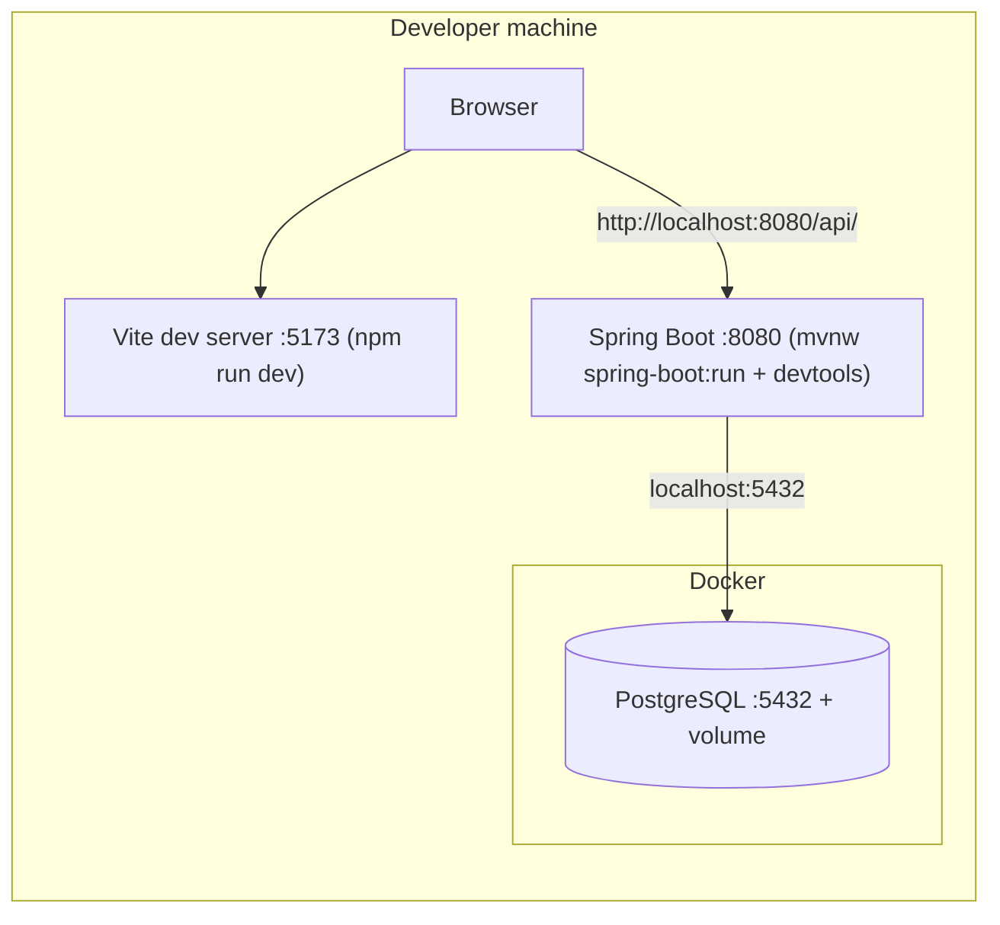
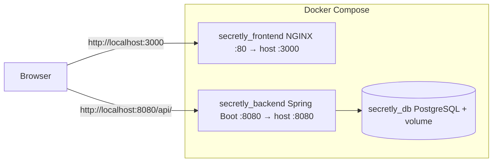
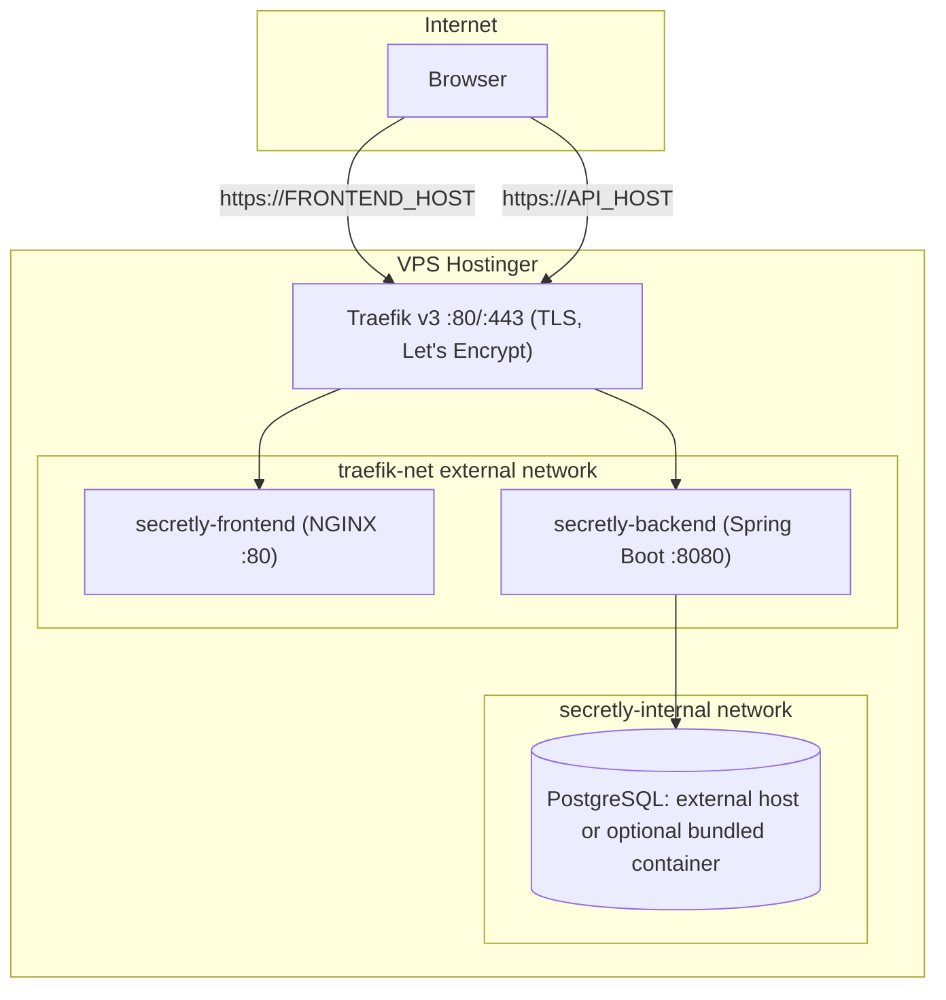

# System Architecture

High-level view of the Secretly system at runtime. This document describes the deployed system (processes, containers, networks and data flow), not the source code.

## Components

| Component | Technology | Role |
|-----------|------------|------|
| Frontend | React + Vite, served by NGINX | Web UI. A static bundle; the API URL is injected at container startup. |
| API | Spring Boot 3.4 (Java 17) | REST API. Encrypts/decrypts secrets with `API_SECRET`, persists to PostgreSQL. |
| Database | PostgreSQL 16 | Stores projects, secrets (encrypted) and the activity log. |

Both the frontend and the API are published as Docker images on DockerHub:

- `wetagustin/secretly_frontend`
- `wetagustin/secretly_api`

### Runtime configuration

- **Frontend**: the image is environment-agnostic. At container startup, `entrypoint.sh` runs `envsubst` over `config.js.template` to generate `config.js` with the `API_URL` env var. The browser loads it as `window.__RUNTIME_CONFIG__`.
- **API**: configured entirely through environment variables (`API_SECRET`, `DB_*`, `CORS_HOST`, `LOGGING_LEVEL`). See [example.env](../example.env).
- **Important**: the browser calls the API directly, so `API_URL` must be a hostname/IP reachable from the user's machine, never a Docker service name.

## Development topology

Only PostgreSQL runs in Docker. The API runs on the host with Spring devtools (hot reload) and the frontend runs with the Vite dev server (HMR).

Started with [scripts/dev.sh](../scripts/dev.sh) (DB + API) and `npm run dev` (frontend). See [development.md](development.md).

## Local production topology

Full stack built from source and run in Docker, used to validate the production images before publishing. Started with [scripts/prod-local.sh](../scripts/prod-local.sh).

## VPS production topology (Traefik)

On the VPS, a shared Traefik v3 proxy terminates TLS (Let's Encrypt) and routes traffic by hostname to containers attached to the external `traefik-net` network. The infrastructure setup lives in [wet333/Infrastructure](https://github.com/wet333/Infrastructure).

Key points:

- No container publishes ports on the host. Traefik reaches them through `traefik-net` and uses the `loadbalancer.server.port` label to know the internal port.
- Two public hostnames, both as DNS A records to the VPS IP:
  - `FRONTEND_HOST` (e.g. `secretly.example.com`) → frontend container, port 80.
  - `API_HOST` (e.g. `api.secretly.example.com`) → API container, port 8080.
- TLS certificates are issued automatically by Traefik's `le-resolver` (Let's Encrypt).
- `CORS_HOST` is set to `FRONTEND_HOST`, so the API only accepts browser requests coming from the public frontend.
- The database is external by default; the compose file ships a commented PostgreSQL service (attached only to `secretly-internal`, never exposed) for self-contained deployments.

## Request flow (VPS)

1. The browser requests `https://FRONTEND_HOST` → Traefik routes to NGINX, which serves the static bundle plus the runtime `config.js` (`API_URL=https://API_HOST/api/`).
2. The browser calls `https://API_HOST/api/...` with HTTP Basic auth → Traefik routes to the Spring Boot container.
3. The API encrypts/decrypts secret values with `API_SECRET` and reads/writes PostgreSQL over the internal network.

## Environment variables

| Variable | Used by | Description |
|----------|---------|-------------|
| `API_URL` | frontend | Public URL of the API as seen from the browser. |
| `API_SECRET` | API | Symmetric key for encrypting secret values. Losing it makes stored secrets unreadable. |
| `DB_HOST` / `DB_PORT` / `DB_NAME` / `DB_USER` / `DB_PASS` | API, DB | PostgreSQL connection. |
| `DB_DLL_MODE` | API | Hibernate schema mode (`update` for persistent DBs, `create-drop` for throwaway ones). |
| `LOGGING_LEVEL` | API | Spring logging level. |
| `CORS_HOST` | API | Frontend host allowed by CORS (no protocol/port). |
| `FRONTEND_HOST` / `API_HOST` | VPS deploy | Public hostnames routed by Traefik. |
| `VERSION` | deploy | DockerHub image tag to run. |
